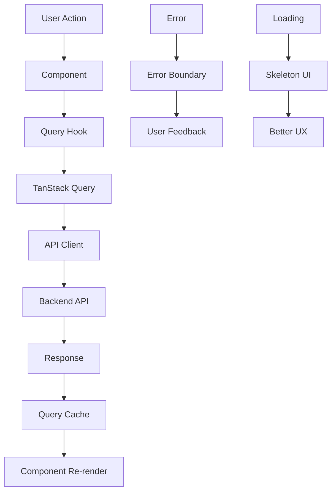

# 🏗️ Complete Architecture Guide - Inventory Management System

## 📋 Overview

This guide demonstrates the complete implementation of a modern React application using **Clean Architecture**, **Single Responsibility Principle (SRP)**, **TanStack Query**, and **Zustand** for state management.

## 🎯 Key Features Implemented

### ✅ **Authentication System**

- **TanStack Query Integration**: All API calls use React Query mutations and queries
- **Zustand Store**: Simplified auth state management
- **Form Validation**: React Hook Form + Zod schemas
- **Error Handling**: Centralized error management
- **Loading States**: Proper loading indicators

### ✅ **Data Fetching Architecture**

- **Query Hooks**: Custom hooks for each entity (auth, inventory, requests)
- **Caching**: Automatic caching and background refetching
- **Optimistic Updates**: Immediate UI updates with rollback on error
- **Error Boundaries**: Graceful error handling

### ✅ **Loading States & UI Components**

- **Skeleton Loaders**: Pre-built skeleton components for different use cases
- **Progress Indicators**: Loading spinners and overlays
- **Data Tables**: Reusable table component with sorting, filtering, pagination
- **Responsive Design**: Mobile-first approach

## 🏛️ Architecture Layers

### 1. **API Layer** (`/api`)

```typescript
// Centralized API client with interceptors
const apiClient = axios.create({
    baseURL: API_BASE_URL,
    withCredentials: true, // HTTP-only cookies
    timeout: 10000,
});

// Automatic token refresh on 401 errors
apiClient.interceptors.response.use(
    (response) => response,
    async (error) => {
        if (error.response?.status === 401) {
            await refreshToken();
            return retryRequest(originalRequest);
        }
    }
);
```

### 2. **Query Hooks** (`/hooks/queries`)

```typescript
// Custom hooks for each entity
export function useAuthQueries() {
  const queryClient = useQueryClient();

  const loginMutation = useMutation({
    mutationFn: authApi.login,
    onSuccess: (data) => {
      setUser(data.user);
      queryClient.invalidateQueries({ queryKey: authKeys.profile() });
    },
  });

  return { loginMutation, profileQuery, ... };
}
```

### 3. **State Management** (`/stores`)

```typescript
// Simplified Zustand stores
export const useAuthStore = create<AuthStore>()(
    persist(
        (set) => ({
            user: null,
            isAuthenticated: false,
            error: null,
            setUser: (user) => set({ user, isAuthenticated: true }),
            clearUser: () => set({ user: null, isAuthenticated: false }),
        }),
        { name: 'auth-storage' }
    )
);
```

### 4. **UI Components** (`/components`)

```typescript
// Reusable data table with full functionality
<DataTable
  data={items}
  columns={columns}
  isLoading={isLoading}
  searchable={true}
  filterable={true}
  pagination={true}
  onRowClick={handleRowClick}
  onExport={handleExport}
/>
```

## 🔄 Data Flow



## 📁 File Structure

```
src/
├── api/                          # API Layer
│   ├── client.ts                 # Axios configuration
│   ├── auth.ts                   # Auth API calls
│   ├── inventory.ts              # Inventory API calls
│   └── requests.ts               # Request API calls
│
├── hooks/queries/                # TanStack Query Hooks
│   ├── useAuth.ts                # Auth queries & mutations
│   ├── useInventory.ts           # Inventory queries & mutations
│   └── useRequests.ts            # Request queries & mutations
│
├── stores/                       # Zustand Stores
│   ├── authStore.ts              # Authentication state
│   ├── inventoryStore.ts         # Inventory state
│   └── requestStore.ts           # Request state
│
├── components/
│   ├── forms/                    # Form Components
│   │   ├── LoginForm.tsx         # Login form with validation
│   │   └── GoogleSignInButton.tsx
│   │
│   ├── ui/                       # UI Components
│   │   ├── data-table.tsx        # Reusable data table
│   │   ├── skeleton.tsx          # Loading skeletons
│   │   └── progress.tsx          # Progress indicators
│   │
│   └── dashboard/                # Dashboard Components
│       └── InventorySummary.tsx  # Summary cards
│
└── pages/                        # Page Components
    ├── Login.tsx                 # Login page
    └── InventoryItems.tsx        # Inventory list page
```

## 🚀 Usage Examples

### **1. Authentication Flow**

```typescript
// In LoginForm component
const { loginMutation, googleLoginMutation } = useAuthQueries();

const onSubmit = async (data: LoginFormData) => {
    try {
        await loginMutation.mutateAsync({
            email: data.email,
            password: data.password,
        });
        navigate('/dashboard');
    } catch (error) {
        // Error handled by mutation
    }
};
```

### **2. Data Fetching with Loading States**

```typescript
// In InventoryItems component
const { itemsQuery, deleteItemMutation } = useInventoryQueries();

if (itemsQuery.isLoading) {
  return <SkeletonTable rows={5} columns={4} />;
}

return (
  <DataTable
    data={itemsQuery.data || []}
    columns={columns}
    isLoading={itemsQuery.isLoading}
    error={itemsQuery.error?.message}
    onRowClick={handleRowClick}
  />
);
```

### **3. Optimistic Updates**

```typescript
// In query hook
const deleteItemMutation = useMutation({
    mutationFn: inventoryApi.deleteItem,
    onSuccess: () => {
        // Invalidate and refetch data
        queryClient.invalidateQueries({ queryKey: inventoryKeys.items() });
    },
});
```

## 🎨 UI Components

### **DataTable Features**

- ✅ **Sorting**: Click column headers to sort
- ✅ **Filtering**: Built-in filter dropdowns
- ✅ **Search**: Real-time search across specified fields
- ✅ **Pagination**: Configurable page sizes
- ✅ **Loading States**: Skeleton loaders while loading
- ✅ **Error Handling**: Graceful error display
- ✅ **Export**: Built-in export functionality
- ✅ **Responsive**: Mobile-friendly design

### **Loading Components**

- ✅ **SkeletonCard**: For card layouts
- ✅ **SkeletonTable**: For table layouts
- ✅ **SkeletonList**: For list layouts
- ✅ **SkeletonForm**: For form layouts
- ✅ **LoadingSpinner**: For buttons and small areas
- ✅ **LoadingOverlay**: For full-page loading

## 🔧 Configuration

### **TanStack Query Setup**

```typescript
// In App.tsx
<QueryClientProvider client={queryClient}>
  <App />
  <ReactQueryDevtools initialIsOpen={false} />
</QueryClientProvider>
```

### **Query Client Configuration**

```typescript
// In lib/queryClient.ts
export const queryClient = new QueryClient({
    defaultOptions: {
        queries: {
            retry: 1,
            staleTime: 30_000,
            refetchOnWindowFocus: false,
        },
    },
});
```

## 📊 Performance Optimizations

### **1. Query Caching**

- Automatic caching of API responses
- Background refetching for fresh data
- Stale-while-revalidate strategy

### **2. Component Optimization**

- React.memo for expensive components
- useMemo for calculated values
- useCallback for event handlers

### **3. Bundle Optimization**

- Code splitting with lazy loading
- Tree shaking for unused code
- Optimized imports

## 🧪 Testing Strategy

### **Unit Tests**

- Query hooks with MSW (Mock Service Worker)
- Component testing with React Testing Library
- Store testing with Zustand testing utilities

### **Integration Tests**

- Full authentication flow
- Data table interactions
- Form submissions

## 🚀 Next Steps

### **Immediate**

1. **Add More Pages**: Implement remaining CRUD pages
2. **Error Boundaries**: Add global error handling
3. **Notifications**: Implement toast notifications
4. **Testing**: Add comprehensive test coverage

### **Advanced Features**

1. **Real-time Updates**: WebSocket integration
2. **Offline Support**: Service worker implementation
3. **Advanced Filtering**: Multi-column filters
4. **Bulk Operations**: Multi-select actions

## 📚 Best Practices Demonstrated

### **1. Single Responsibility Principle**

- Each component has one clear purpose
- Query hooks handle only data fetching
- Stores manage only state

### **2. Clean Architecture**

- Clear separation of concerns
- Dependency inversion
- Testable components

### **3. Type Safety**

- Full TypeScript coverage
- Proper interface definitions
- Generic components

### **4. Error Handling**

- Centralized error management
- User-friendly error messages
- Graceful degradation

### **5. Performance**

- Efficient re-renders
- Optimized queries
- Lazy loading

This architecture provides a solid foundation for building scalable, maintainable React applications with excellent developer experience and user experience.
