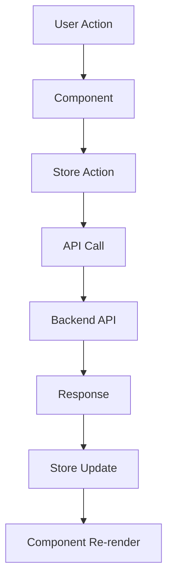

# 📁 Project Structure - Inventory Management System

## 🏗️ Architecture Overview

This React application follows **Clean Architecture** and **Single Responsibility Principle (SRP)** with a modern tech stack:

- **State Management**: Zustand (replacing Context API)
- **Form Management**: React Hook Form + Zod validation
- **UI Components**: Radix UI + Tailwind CSS
- **API Layer**: Axios with interceptors
- **Type Safety**: TypeScript throughout

## 📂 Directory Structure

```
src/
├── api/                          # API Layer (Clean Architecture)
│   ├── client.ts                 # Axios configuration & interceptors
│   ├── auth.ts                   # Authentication API calls
│   ├── inventory.ts              # Inventory management API calls
│   ├── requests.ts               # Request management API calls
│   └── users.ts                  # User management API calls
│
├── components/                   # Reusable UI Components
│   ├── forms/                    # Form Components (SRP)
│   │   ├── LoginForm.tsx         # Login form with validation
│   │   ├── GoogleSignInButton.tsx # Google OAuth component
│   │   ├── InventoryForm.tsx     # Inventory item form
│   │   └── RequestForm.tsx       # Request creation form
│   │
│   ├── ui/                       # Base UI Components (Radix + Tailwind)
│   │   ├── button.tsx
│   │   ├── input.tsx
│   │   ├── card.tsx
│   │   └── ...
│   │
│   ├── nav/                      # Navigation Components
│   │   ├── Sidebar.tsx
│   │   └── Topbar.tsx
│   │
│   └── common/                   # Common Components
│       ├── LoadingSpinner.tsx
│       ├── ErrorBoundary.tsx
│       └── ConfirmDialog.tsx
│
├── stores/                       # Zustand State Management
│   ├── authStore.ts              # Authentication state
│   ├── inventoryStore.ts         # Inventory management state
│   ├── requestStore.ts           # Request management state
│   ├── cartStore.ts              # Shopping cart state
│   └── uiStore.ts                # UI state (modals, themes, etc.)
│
├── pages/                        # Page Components
│   ├── auth/
│   │   └── Login.tsx
│   ├── admin/
│   │   ├── Dashboard.tsx
│   │   ├── Departments.tsx
│   │   └── CreateStorekeeper.tsx
│   ├── storekeeper/
│   │   ├── Dashboard.tsx
│   │   ├── Inventory.tsx
│   │   └── Reports.tsx
│   └── staff/
│       ├── Dashboard.tsx
│       └── Cart.tsx
│
├── hooks/                        # Custom Hooks
│   ├── useAuth.ts                # Authentication hook
│   ├── usePermissions.ts         # Permission checking hook
│   ├── useApi.ts                 # API call hook
│   └── useLocalStorage.ts        # Local storage hook
│
├── lib/                          # Utility Libraries
│   ├── utils.ts                  # General utilities
│   ├── auth-utils.ts             # Authentication utilities
│   ├── permissions.ts            # Permission definitions
│   └── validations.ts            # Zod schemas
│
├── types/                        # TypeScript Type Definitions
│   ├── index.ts                  # Main type exports
│   ├── api.ts                    # API response types
│   ├── auth.ts                   # Authentication types
│   └── inventory.ts              # Inventory types
│
├── config/                       # Configuration Files
│   ├── dev.ts                    # Development configuration
│   ├── api.ts                    # API configuration
│   └── constants.ts              # Application constants
│
└── contexts/                     # React Contexts (Legacy - being migrated)
    ├── AuthContext.tsx           # Will be replaced by authStore
    ├── SearchContext.tsx         # Global search context
    └── NotificationContext.tsx   # Notification context
```

## 🔄 State Management Architecture

### Zustand Stores

Each store follows a consistent pattern:

```typescript
interface StoreState {
    // Data
    items: Item[];
    isLoading: boolean;
    error: string | null;

    // UI State
    selectedItem: Item | null;
    filters: FilterState;
}

interface StoreActions {
    // CRUD Operations
    fetchItems: () => Promise<void>;
    createItem: (item: CreateItemDto) => Promise<Item>;
    updateItem: (item: UpdateItemDto) => Promise<Item>;
    deleteItem: (id: number) => Promise<void>;

    // UI Actions
    setSelectedItem: (item: Item | null) => void;
    setFilters: (filters: Partial<FilterState>) => void;

    // Error Handling
    setError: (error: string | null) => void;
    clearError: () => void;
}
```

## 🎯 Single Responsibility Principle Implementation

### 1. **API Layer** (`/api`)

- **Responsibility**: Handle all HTTP communication
- **Features**:
    - Axios interceptors for auth tokens
    - Error handling and transformation
    - Request/response logging
    - Type-safe API calls

### 2. **Store Layer** (`/stores`)

- **Responsibility**: Manage application state
- **Features**:
    - Centralized state management
    - Async action handling
    - Persistence (where needed)
    - DevTools integration

### 3. **Component Layer** (`/components`)

- **Responsibility**: Render UI and handle user interactions
- **Features**:
    - Reusable form components
    - Consistent styling
    - Accessibility support
    - Error boundaries

### 4. **Page Layer** (`/pages`)

- **Responsibility**: Compose components into full pages
- **Features**:
    - Route-specific layouts
    - Data fetching coordination
    - User permission checks

## 🔐 Authentication Flow

```mermaid
graph TD
    A[User Login] --> B[LoginForm Component]
    B --> C[AuthStore.login()]
    C --> D[API Call to /api/auth/login]
    D --> E[HTTP-only Cookie Set]
    E --> F[User State Updated]
    F --> G[Navigate to Dashboard]

    H[Page Load] --> I[AuthStore.checkAuth()]
    I --> J[API Call to /api/auth/refresh]
    J --> K{Token Valid?}
    K -->|Yes| L[User Authenticated]
    K -->|No| M[Redirect to Login]
```

## 📊 Data Flow Architecture



## 🛠️ Development Guidelines

### 1. **Component Creation**

- Create components in appropriate directories
- Use TypeScript interfaces for props
- Implement proper error handling
- Add accessibility attributes

### 2. **Store Management**

- Keep stores focused on single domain
- Use async actions for API calls
- Implement proper error states
- Add loading states for better UX

### 3. **API Integration**

- Use the centralized API client
- Handle errors consistently
- Implement proper TypeScript types
- Add request/response logging

### 4. **Form Handling**

- Use React Hook Form for form state
- Implement Zod validation schemas
- Provide clear error messages
- Handle loading and disabled states

## 🚀 Next Steps

1. **Complete Store Migration**: Replace remaining Context API usage with Zustand
2. **Form Components**: Create comprehensive form component library
3. **Error Handling**: Implement global error boundary and notification system
4. **Testing**: Add unit tests for stores and components
5. **Performance**: Implement React.memo and useMemo optimizations
6. **Documentation**: Add JSDoc comments and Storybook stories

## 📝 Code Standards

- **TypeScript**: Strict mode enabled
- **ESLint**: Airbnb configuration
- **Prettier**: Consistent code formatting
- **Husky**: Pre-commit hooks
- **Conventional Commits**: Standardized commit messages
